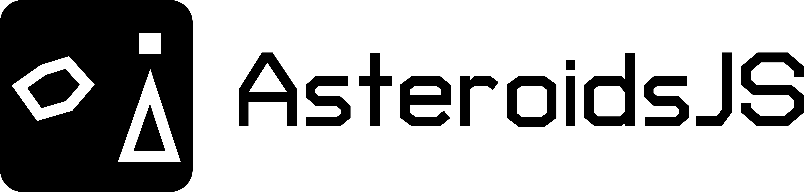
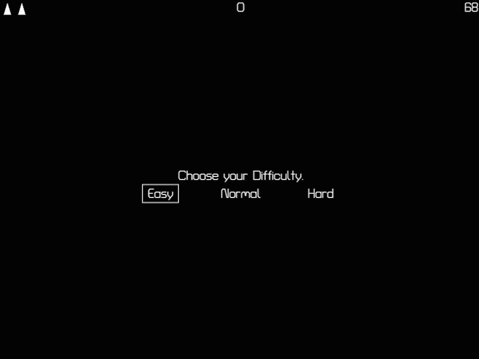

 

AsteroidsJS is an Asteroids clone written in vanilla JavaScript, using the
Canvas API to draw and animate the game objects with no rendering framework.
Play it now at https://jdtalley.itch.io/asteroidsjs.

[](https://jdtalley.itch.io/asteroidsjs)

## Controls

| Action           | Keys                     |
| ---------------- | ------------------------ |
| Rotate ship      | `A`/`D` or `←`/`→`        |
| Thrust / brake   | `W`/`S` or `↑`/`↓`        |
| Fire             | `Space`                  |
| Pause / confirm  | `Enter` or `P`            |

Score 50 points to earn an extra life. High score is saved to the browser's
`localStorage`.

## Development

Requires Node `>=22.12.0` (see `.nvmrc`).

```sh
npm install
npm start        # dev server with hot reload (Vite)
npm run build    # production build to dist/
npm test         # run the Vitest unit test suite
npm run lint     # ESLint
npm run format   # Prettier check
```

The game entry point is `src/index.js`; the game loop drives model classes
under `src/models/` (`Entity`, `Spaceship`, `Asteroid`, `Bullet`,
`Difficulty`), which are rendered and played through the browser-API
wrappers in `src/lib/` (`canvas.js`, `sound.js`).

Continuous integration (`.github/workflows/ci.yml`) runs lint, format-check,
tests, and the build on every push and pull request. Tagged `v*` pushes
additionally trigger `.github/workflows/release.yml`, which attaches a
built `dist/` zip to a GitHub Release — see `CHANGELOG.md` for what's in
each release.

